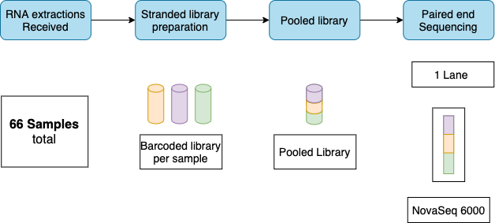
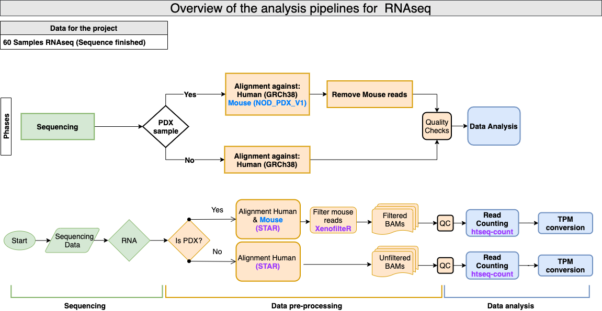
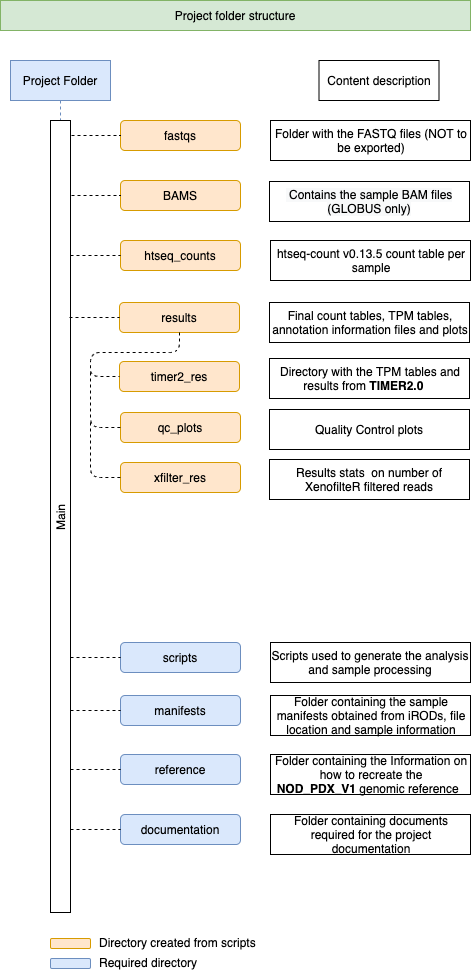

# PDXs from Latin America - RNAseq
This Github repository contains the scripts, documentation and methodology used for retrieval of the sequencing data from Sanger's internal database, alignment, _NOD/ShiLtJ_ custom reference sequence creation and read filtering process, counting and QC analysis of the RNAseq sequencing data for the samples of this project.  Along with the information and documentation of analysis procedures, steps and scripts used to generate the data withint this repository . 

## Sequencing strategy
The data was generated using a balanced blocked design for the creation of a pooled library  

## Analysis methodology 
The entire processing pipeline is explained in broad terms in the following diagram:

To see a detailed list of the commands used for running the scripts see here:
[Detailed running commands and steps](./documentation/Detailed_running_commands.md)

 
## Project folder structure
The current project contains the most relevant and essential directories for the results reproduction. Big data files (such as BAM, fastqs and reference files) will be only shared via Globus. 

A description of the current GitLab project and its contents is shown in the following diagram:

## Reference genome generation  
## Mouse reference sequence creation for mouse PDX filtering

The information of the commands used to generate the FASTA files and indeces used for mapping against the NOD/ShiLtJ genome is desc1ribed in:

+ [NOD_ShiLtJ_V1 PDX reference creation](./reference/PDX_from_LatAm_mouse_reference_generation_NOD_ShiLtJ_v1.html)

## Software dependencies
Software required can be obtained from the following links here:

+ **R v4.1.0**  [here](https://cran.r-project.org/) The list of R and Bioconductor packages used can be found [here](./results/Analysis_R_session_INFO.txt)
    + **XenofilteR v1.6** [here](https://github.com/NKI-GCF/XenofilteR)
+ **STAR v2.7.10a** [here](https://github.com/alexdobin/STAR/archive/refs/tags/2.7.10a.tar.gz) 
+ **HTseq 0.13.5** [here](https://htseq.readthedocs.io/en/master/install.html#installation-on-linux) 
+ **bwa v0.7.17**
+ **CAVEMa v1.17.4**
+ **cgpPindel v3.9.0**
+ **ESNEMBL VEPv103**
+ **SAMTOOLS 1.13** [here](https://github.com/samtools/samtools/releases/download/1.13/samtools-1.13.tar.bz2) 
+ **RSeQC v4.0.0** [here](http://rseqc.sourceforge.net/) 

## Licence
This code is released under the [MIT license](https://opensource.org/licenses/MIT)

Copyright (C) 2021 Genome Research Ltd.
